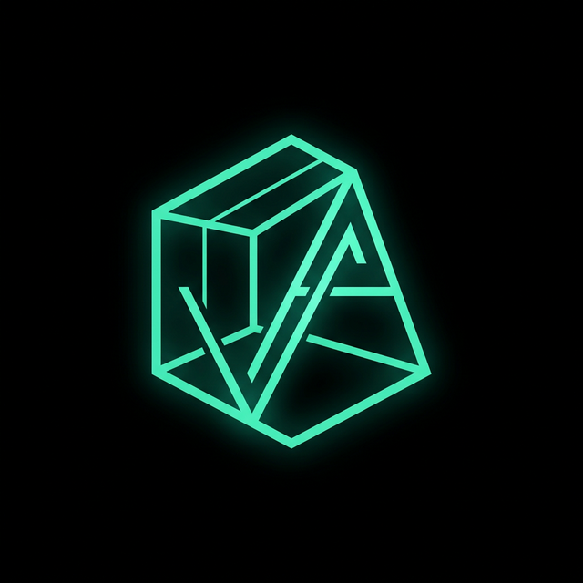

# VaroIntAi Designs — Viewport to Render



**Transforma tus capturas del viewport en renders fotorrealistas profesionales con IA.**

Aplicación diseñada para arquitectos y diseñadores de interiores. Sube una captura de tu modelo 3D, añade referencias de estilo y objetos, y genera visualizaciones fotorrealistas con la API gratuita de Google Gemini.

## 🚀 Características Principales

- **Renderizado AI con Gemini**: Integración directa con la API REST de Google (Nano Banana 2).
- **Selector de Modelo**: Elige entre 3 modelos:
    - ⭐ **Nano Banana 2** (`gemini-3.1-flash-image-preview`) — 500 imágenes/día gratis
    - ⚡ **Nano Banana** (`gemini-2.5-flash-image`) — Rápido y gratuito
    - 💎 **Nano Banana Pro** (`gemini-3-pro-image-preview`) — Premium/4K
- **Editor Avanzado de Canvas**: Zonas, anotaciones a mano alzada y máscara de control.
- **Multi-Upload**: Hasta 10 imágenes de referencia de estilo + objetos, con comentarios individuales.
- **Presets de Prompts**: Guarda y carga versiones de tus instrucciones de sistema.
- **Ajustes de Salida**: Upscale hasta 4x, formatos PNG/WEBP/JPG.
- **Diseño Responsivo**: Móvil, Tablet, PC y TV.
- **100% en Español**.

## 🛠️ Tecnologías

- **Frontend**: React + TypeScript + Vite
- **Estilos**: Glassmorphism + Dark Mode premium
- **Iconos**: Lucide React
- **Animaciones**: Framer Motion
- **API**: Google Gemini REST API (generativelanguage.googleapis.com)

## 📦 Instalación Local

```bash
git clone https://github.com/VaroTv7/varo_design_renders.git
cd varo_design_renders
npm install
npm run dev
```

Abre `http://localhost:5173` → Ajustes → Introduce tu API Key de [Google AI Studio](https://aistudio.google.com/apikey) → ¡Listo!

## 🐳 Despliegue con Docker

```bash
# Clonar
git clone https://github.com/VaroTv7/varo_design_renders.git
cd varo_design_renders

# Construir y levantar
docker-compose up -d --build

# Acceder
# http://localhost:8080
```

Para cambiar el puerto, edita `docker-compose.yml`:
```yaml
ports:
  - "TU_PUERTO:80"
```

## 🔑 Obtener API Key (Gratis)

1. Ve a [Google AI Studio](https://aistudio.google.com/apikey)
2. Inicia sesión con tu cuenta de Google
3. Crea una nueva API Key
4. Pégala en **Ajustes → API y Modelo → API Key**

> **500 imágenes/día gratis** con Nano Banana 2. Sin tarjeta de crédito.

## 🤝 Contribución

Las contribuciones son bienvenidas. Abre un issue para discutir cambios mayores.

## 📄 Licencia

MIT
